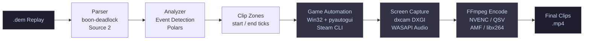

# Deadlock Auto-Clipper


Automated highlight clip generator for Deadlock. Parses `.dem` replay files to detect multikills, kill streaks, and objective events — then automates the game client to replay and record each moment as a GPU-encoded `.mp4`.

---

## Pipeline



The pipeline runs through a Flask web UI with background job execution and real-time status polling. Each stage is independently invokable via CLI.

---

## Features

- Parses Source 2 `.dem` replay files using the `boon-deadlock` library
- Detects four event types: multikill, kill streak, single kill, objective destruction
- Greedy multikill grouping and stateful kill-streak tracking algorithms
- Smart post-detection clip merging to prevent duplicate clips on back-to-back events
- Runtime GPU encoder detection with automatic fallback: NVENC → QSV → AMF → libx264
- GPU-accelerated screen capture via DXGI (DirectX) — no OBS required
- System audio capture via WASAPI loopback with COM/MTA thread isolation
- Win32 window automation: focus management via `AttachThreadInput`, console command injection
- Async Flask REST API with background job system and polling endpoints
- Fully config-driven: all thresholds, paths, and game constants live in `config.yaml`

---

## Required Technologies

| Category | Technology |
|---|---|
| Language | Python 3.12 |
| Package manager | [uv](https://github.com/astral-sh/uv) |
| Replay parsing | [boon-deadlock](https://pypi.org/project/boon-deadlock/) (Source 2 `.dem`) |
| Screen capture | [dxcam](https://github.com/ra1nty/DXcam) (DXGI) |
| Video encoding | FFmpeg via [VidGear](https://abhitronix.github.io/vidgear/) |
| Audio capture | [soundcard](https://github.com/bastibe/SoundCard) (WASAPI loopback) |
| Web UI | [Flask](https://flask.palletsprojects.com/) |
| Data processing | [Polars](https://pola.rs/) |
| Game automation | pyautogui + Win32 API (ctypes) |
| Configuration | PyYAML + python-dotenv |

**System requirements**

- Windows 10 or 11
- Python 3.12+
- FFmpeg available on `PATH`
- Deadlock installed via Steam
- GPU with NVENC / QSV / AMF support (optional — CPU fallback via libx264)

---

## Setup

**1. Install prerequisites**

- [Python 3.12](https://python.org/downloads/)
- [uv](https://docs.astral.sh/uv/getting-started/installation/)
- [FFmpeg](https://ffmpeg.org/download.html) — must be on `PATH` (verify with `ffmpeg -version`)

**2. Clone and install dependencies**

```bash
git clone https://github.com/your-username/deadlock-auto-clipper.git
cd deadlock-auto-clipper
uv sync
```

**3. Configure environment**

```bash
cp .env.example .env
```

Open `.env` and set your Steam ID64:

```
DEADLOCK_STEAM_ID=76561198XXXXXXXXX
```

**4. Edit `config.yaml`**

At minimum, update these three values:

```yaml
watcher:
  hotfolder: 'C:\Program Files (x86)\Steam\steamapps\common\Deadlock\game\citadel\replays'

recording:
  steam_exe: 'C:\Program Files (x86)\Steam\steam.exe'

clips:
  output_dir: 'C:/Users/YourName/Videos'
```

**5. Launch the web UI**

```bash
python serve.py
```

Open `http://localhost:5000` in your browser.

---

## Usage

**Analysis tab**

1. Select a `.dem` file from the dropdown (or paste a full path)
2. Choose your Steam ID from the player list and select an event type (multikill, kill streak, single kill, or objective)
3. Click **Analyze** — clip zones appear as a list with timestamps and event details

**Recording tab**

1. Click **Connect** to initialize the capture backend (GPU encoder is auto-detected and displayed)
2. Queue clips from the analysis results
3. Click **Record** — the pipeline launches Deadlock, seeks to each clip, records, and saves

Clips are saved to `clips.output_dir` from `config.yaml`.

---

## CLI

Each stage is also available as a standalone command after `uv sync`:

```bash
# Parse a replay file to JSON
deadlock-clipper parse path/to/replay.dem

# Detect clip zones from parsed output
deadlock-clipper analyze path/to/parsed.json

# Test the capture backend (add --record to write a test clip)
deadlock-clipper capture-test --record

# Test game launch and console automation
deadlock-clipper launch-test path/to/replay.dem
```

---

## Architecture

The codebase is split into three layers with a strict one-way dependency rule:

- **`core/`** — pure data transformation: `parser.py` (Source 2 → Python dicts) and `analyzer.py` (dicts → clip zones). No I/O side effects; importable anywhere.
- **`recording/`** — Windows-only automation: screen capture, GPU encoding, Win32 window management, Steam/console automation.
- **`web/`** — Flask API and UI: wraps `core` and `recording` behind REST endpoints, manages background job state and a thread-safe parse cache.

The capture backend is accessed via a `CapturePort` protocol (`ports/capture.py`), keeping `recording` swappable without touching the rest of the codebase.

---

## Project Status

| Stage | Status |
|---|---|
| Replay parsing | Complete |
| Event detection (analyzer) | Complete |
| Game automation & screen capture | Complete |
| Flask web UI | Complete |
| Watchdog auto-ingestion (`main.py`) | Planned |
| FFmpeg clip trimming (post-process) | Planned |
